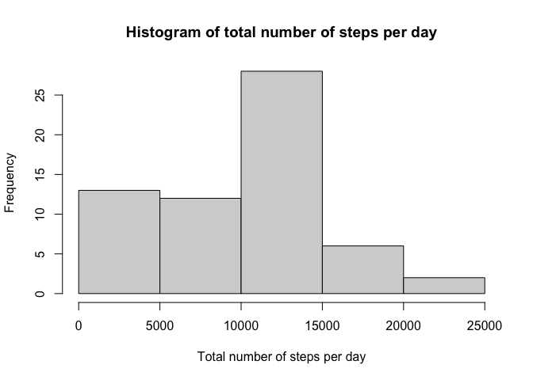
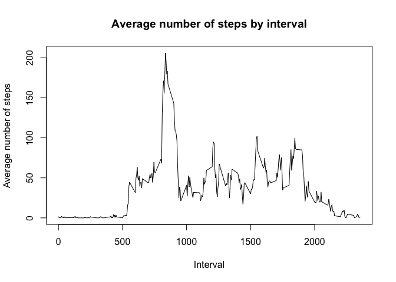
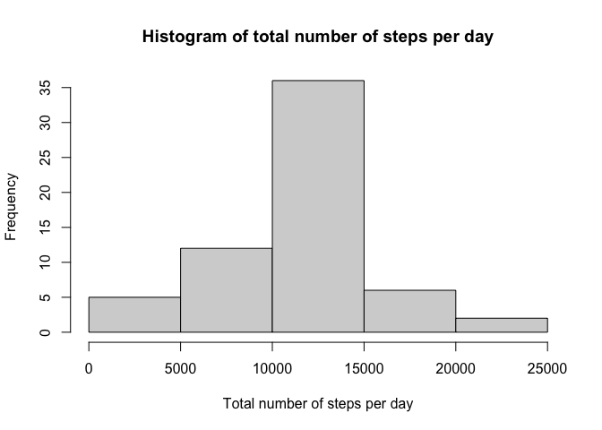
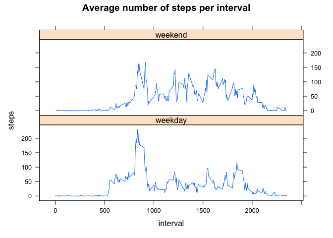

## Loading and preprocessing the data

Loading libraries

```r
options(warn = -1)
library(dplyr)
library(lattice)
```

Loading data

```r
unzip("activity.zip")
activity <- read.csv("activity.csv")
activity$date <- as.Date(activity$date)

head(activity)
```

  steps       date interval
1    NA 2012-10-01        0
2    NA 2012-10-01        5
3    NA 2012-10-01       10
4    NA 2012-10-01       15
5    NA 2012-10-01       20
6    NA 2012-10-01       25


## What is mean total number of steps taken per day?

First of all, we group the steps by day

```r
stepsByDay <- activity %>%
  group_by(date) %>%
  summarize(steps = sum(steps, na.rm = TRUE))

head(stepsByDay)
```

```
## # A tibble: 6 x 2
##   date       steps
##   <date>     <int>
## 1 2012-10-01     0
## 2 2012-10-02   126
## 3 2012-10-03 11352
## 4 2012-10-04 12116
## 5 2012-10-05 13294
## 6 2012-10-06 15420
```

We plot the histogram of steps per day

```r
hist(stepsByDay$steps, xlab = "Total number of steps per day",
     main = "Histogram of total number of steps per day")
```

<!-- -->

Now, we find the mean and median

```r
meanSteps <- round(mean(stepsByDay$steps))
medianSteps <- round(median(stepsByDay$steps))
```

The mean is 9354 and the median is 1.0395\times 10^{4}.

## What is the average daily activity pattern?

We plot the graph of daily activity pattern


```r
stepsByInterval <- activity %>%
  group_by(interval) %>%
  summarize(averageIntervalSteps = mean(steps, na.rm = TRUE))

with(stepsByInterval, plot(
  interval, averageIntervalSteps, type = "l", ylab = "Average number of steps",
  main = "Average number of steps by interval", xlab = "Interval"
))
```

<!-- -->

What is the interval with the maximum number of steps?

```r
maxInterval <- head(stepsByInterval %>%
  arrange(-averageIntervalSteps), 1)

maxInterval[[1, 1]]
```

[1] 835


## Imputing missing values

First of all, we calculate the number of missing values

```r
sum(is.na(activity$steps))
```

```
## [1] 2304
```

We use the mean of the interval to replace missing values.

```r
activity2 <- activity %>%
  mutate(steps = ifelse(is.na(steps), stepsByInterval$averageIntervalSteps , steps))

sum(is.na(activity2$steps))
```

```
## [1] 0
```

We once again count the total number of steps per day with replaced missing values.

```r
stepsByDay2 <- activity2 %>%
  group_by(date) %>%
  summarize(steps = sum(steps, na.rm = TRUE))

head(stepsByDay2)
```

```
## # A tibble: 6 x 2
##   date        steps
##   <date>      <dbl>
## 1 2012-10-01 10766.
## 2 2012-10-02   126 
## 3 2012-10-03 11352 
## 4 2012-10-04 12116 
## 5 2012-10-05 13294 
## 6 2012-10-06 15420
```

We plot our new histogram.

```r
hist(stepsByDay2$steps, xlab = "Total number of steps per day",
     main = "Histogram of total number of steps per day")
```

<!-- -->


We also find the new mean and median.

```r
newMean <- round(mean(stepsByDay2$steps, na.rm = TRUE))
newMedian <- round(median(stepsByDay2$steps, na.rm = TRUE))
```

After replacing the missing values the new mean is 1.0766\times 10^{4} and new median
is 1.0766\times 10^{4}.

**Conclusion:** By imputing the missing values the total number of steps increased and,
hence, the mean and median both increased. Therefore, the new histogram has less low
values.

## Are there differences in activity patterns between weekdays and weekends?

We create a new factor variable for weekdays and weekend days.

```r
assignDayType <- function(day) {
  factor(ifelse(day %in% c("Saturday", "Sunday"), "weekend", "weekday"))
}
```

We group the data into two categories: one for weekdays and second for weekend days.

```r
activity2 <- activity2 %>%
  mutate(day = assignDayType(weekdays(date)))

head(activity2)
```

```
##       steps       date interval     day
## 1 1.7169811 2012-10-01        0 weekday
## 2 0.3396226 2012-10-01        5 weekday
## 3 0.1320755 2012-10-01       10 weekday
## 4 0.1509434 2012-10-01       15 weekday
## 5 0.0754717 2012-10-01       20 weekday
## 6 2.0943396 2012-10-01       25 weekday
```

We make two plots showing the average number of steps in interval for the two categories.


```r
weekdays <- activity2 %>%
  filter(day == "weekday") %>%
  group_by(interval) %>%
  summarise(steps = mean(steps)) %>%
  mutate(day = "weekday")

weekends <- activity2 %>%
  filter(day == "weekend") %>%
  group_by(interval) %>%
  summarise(steps = mean(steps)) %>%
  mutate(day = "weekend")

groupedByDay <- rbind(weekdays, weekends)

with(groupedByDay, xyplot(steps~interval|day, type = "l", layout = c(1, 2),
                          main = "Average number of steps per interval"))
```

<!-- -->
